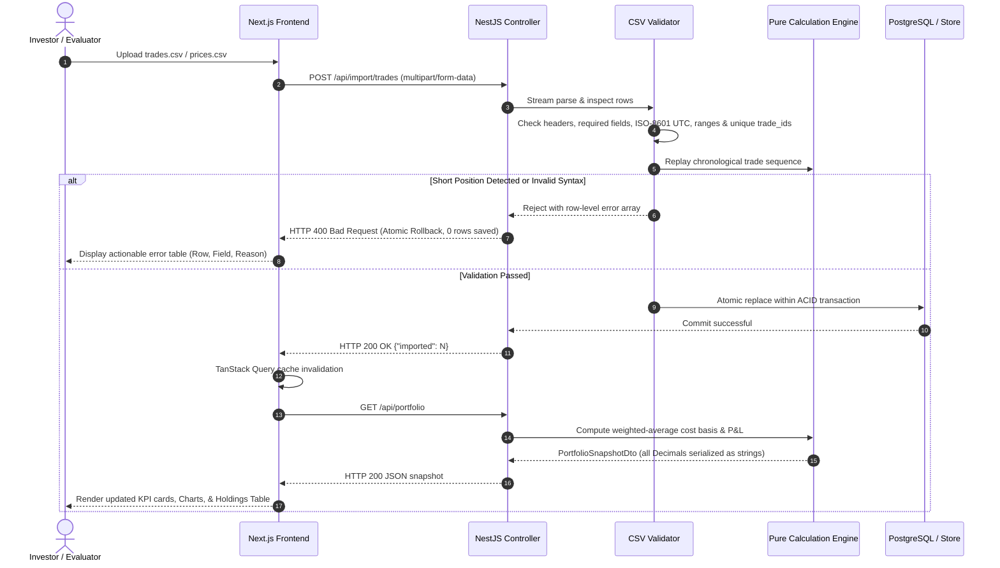

# KRYPTON | Crypto Portfolio Analytics

[](https://crypto-portfolio-vert.vercel.app/)
[](https://crypto-portfolio-api-x8e3.onrender.com/api/docs)
[-brightgreen?style=flat&logo=jest)](https://github.com/ducmanh1101/crypto-portfolio)
[](https://www.typescriptlang.org/)
[](https://nextjs.org/)
[](https://nestjs.com/)

A production-grade full-stack dashboard for analyzing a cryptocurrency portfolio's holdings, cost basis, and profit/loss from supplied trade histories with **zero external market price dependencies**. Built with **NestJS**, **TypeORM**, and **PostgreSQL** on the backend, and **Next.js 14 (App Router)**, **Tailwind CSS**, and **TanStack Query** on the frontend.

---

## 🌐 Live Deployments

The application is deployed to production cloud platforms and accessible publicly:

* **Live Frontend Application (Vercel):** [https://crypto-portfolio-vert.vercel.app/](https://crypto-portfolio-vert.vercel.app/)
* **Live Backend API (Render):** [https://crypto-portfolio-api-x8e3.onrender.com](https://crypto-portfolio-api-x8e3.onrender.com)
* **Interactive Swagger Documentation:** [https://crypto-portfolio-api-x8e3.onrender.com/api/docs](https://crypto-portfolio-api-x8e3.onrender.com/api/docs)
* **Source Code Repository:** [https://github.com/ducmanh1101/crypto-portfolio](https://github.com/ducmanh1101/crypto-portfolio)

> [!NOTE]
> **Render Free-Tier Spin-Up (Cold Starts):**
> The backend is hosted on Render's free tier. If the service has been inactive, Render automatically spins down the instance. The first request may take **30–50 seconds** to boot. Once active, all subsequent calculations and API responses respond in milliseconds.

---

## 📂 Sample Data & Reset Instructions

The application uses the supplied CSV files as its single source of truth. As required by the assessment specification, all supplied datasets and fixtures remain permanently available in the repository root [`data/`](https://github.com/ducmanh1101/crypto-portfolio/tree/main/data):

* [`data/trades.csv`](https://github.com/ducmanh1101/crypto-portfolio/blob/main/data/trades.csv): ~200 synthetic BUY and SELL trades over 6 months across Binance & Coinbase for `BTC`, `ETH`, `SOL`, `CKB`, and `DOGE`.
* [`data/prices.csv`](https://github.com/ducmanh1101/crypto-portfolio/blob/main/data/prices.csv): Market price snapshot as of `2026-03-31T23:59:59.000Z`.

### How to Load or Reset Sample Data

Evaluators can reload or reset the data at any time using any of the following 3 methods:

1. **Method 1: One-Click UI Reset (Recommended)**
   * Open the live app [https://crypto-portfolio-vert.vercel.app/](https://crypto-portfolio-vert.vercel.app/).
   * Click the **"Reset"** button (counter-clockwise arrow icon) located in the top navigation bar.
   * This immediately calls `POST /api/portfolio/reset`, clears the database/store, and re-seeds the canonical 200 trades and price snapshots.
2. **Method 2: Interactive CSV Importer (Drag & Drop)**
   * Click **"Import CSV"** or **"Open Advanced Importer"** on the dashboard.
   * Drag and drop [`data/trades.csv`](https://github.com/ducmanh1101/crypto-portfolio/blob/main/data/trades.csv) or [`data/prices.csv`](https://github.com/ducmanh1101/crypto-portfolio/blob/main/data/prices.csv) into the dropzone.
   * The backend executes atomic validation and replays trades before committing.
3. **Method 3: Terminal / cURL API**
   ```bash
   # Reset live Render deployment:
   curl -X POST https://crypto-portfolio-api-x8e3.onrender.com/api/portfolio/reset

   # Or reset local backend:
   curl -X POST http://localhost:3001/api/portfolio/reset
   ```

### Evaluator Test Fixtures

To verify the atomic validation engine and short-position rejection, additional stress-test datasets are included in `data/`:
* `trades_valid_1.csv` & `trades_valid_2.csv`: Valid sequences (125 & 135 trades) with dollar-cost averaging (DCA) and partial profit taking.
* `trades_invalid_1.csv`: Schema and syntax violations (missing IDs, duplicate IDs, invalid timestamps, unsupported exchanges/symbols, negative values).
* `trades_invalid_2.csv`: Syntactically valid rows that violate the **chronological short-position constraint** (selling more than held at that point in time).
* `trades_invalid_3.csv`: Boundary edge cases (zero quantities/prices, invalid casing, missing timezone suffix).

---

## 🏛️ Architecture & Data Flow

The project follows a clean separation of concerns:

```
crypto-portfolio/
├── backend/                  NestJS Modular API (TypeScript)
│   ├── src/calculation/     Pure financial calculation engine (ZERO framework/DB dependencies)
│   ├── src/database/        TypeORM PostgreSQL entities & socket connection health-check
│   ├── src/import/          CSV stream parsing, schema validation & cross-row replay check
│   ├── src/portfolio/       PortfolioStore (PostgreSQL persistence + in-memory fallback) & Service
│   ├── src/trades/          Transaction Explorer API (search, multi-filter, sort, pagination)
│   ├── src/dto/             OpenAPI / Swagger typed data transfer contracts
│   └── src/common/          Global HTTP exception filter & standardized error envelopes
├── frontend/                 Next.js 14 App Router (React, Tailwind CSS, TypeScript)
│   ├── app/                 Dashboard (`/`) and Transaction Explorer (`/transactions`)
│   ├── components/          SummaryCards, HoldingsTable, Charts, ImportModal, TopNav, ThemeProvider
│   ├── lib/hooks/           TanStack Query reactive hooks (`usePortfolio`, `useTrades`, `useImport`)
│   ├── lib/format.ts        Display precision, sub-cent formatting & accessible color-blind tags
│   └── lib/types.ts         Typed contracts mirroring Swagger DTOs
├── data/                     Canonical CSV files and test fixtures
└── docker-compose.yml        PostgreSQL 16 container definition
```

### Full-Stack Data Flow



---

## 🧮 Portfolio Calculation Approach

The core engine is implemented as a set of pure deterministic functions in [`backend/src/calculation/portfolio-calculator.ts`](https://github.com/ducmanh1101/crypto-portfolio/blob/main/backend/src/calculation/portfolio-calculator.ts). It strictly implements the weighted-average cost basis algorithm specified in the assessment:

### 1. Chronological Processing
Transactions are grouped by asset symbol (`BTC`, `ETH`, `SOL`, `CKB`, `DOGE`) and processed in **ascending UTC timestamp order**.

### 2. BUY Transactions (Capitalized Fees)
* **Gross Buy Value**: $\text{gross buy value} = \text{quantity} \times \text{price\_usd}$
* **Cost Added**: $\text{cost added} = \text{gross buy value} + \text{fee\_usd}$
* **New Quantity**: $\text{new quantity} = \text{previous quantity} + \text{bought quantity}$
* **New Cost Basis**: $\text{new cost basis} = \text{previous cost basis} + \text{cost added}$
* **Average Cost**: $\text{average cost} = \frac{\text{new cost basis}}{\text{new quantity}}$
* *Note:* BUY fees are capitalized directly into the asset's cost basis.

### 3. SELL Transactions (Proceeds Reduction)
* **Gross Proceeds**: $\text{gross proceeds} = \text{quantity} \times \text{price\_usd}$
* **Net Proceeds**: $\text{net proceeds} = \text{gross proceeds} - \text{fee\_usd}$
* **Cost Removed**: $\text{cost removed} = \text{average cost before sale} \times \text{sold quantity}$
* **Realized P&L**: $\text{realized P\&L} = \text{net proceeds} - \text{cost removed}$
* **New Quantity**: $\text{new quantity} = \text{previous quantity} - \text{sold quantity}$
* **New Cost Basis**: $\text{new cost basis} = \text{previous cost basis} - \text{cost removed}$
* *Note:* The SELL fee reduces net proceeds. A SELL **never changes the average cost** of the remaining position.

### 4. Full Close & Reopened Positions
If a position is fully sold ($\text{quantity} = 0$), remaining quantity, cost basis, and average cost are cleanly reset to **0**. Any subsequent BUY starts fresh without carrying legacy rounding dust. Realized P&L is permanently retained.

### 5. Short Position Rejection
A SELL is prohibited from exceeding the quantity available at that point in the chronological trade history. Attempting to sell more than held throws a `ShortPositionError` and halts the import before any database state is modified.

### 6. Current Valuation & Portfolio Metrics
* $\text{current value} = \text{quantity held} \times \text{current price}$
* $\text{unrealized P\&L} = \text{current value} - \text{current cost basis}$
* $\text{total P\&L} = \text{realized P\&L} + \text{unrealized P\&L}$
* $\text{allocation \%} = \frac{\text{asset current value}}{\text{portfolio current value}}$
* $\text{total fees paid} = \sum \text{BUY fees} + \sum \text{SELL fees}$

---

## 🔢 Precision and Rounding Decisions

Financial calculations must never suffer from IEEE-754 binary floating-point errors (e.g. `0.1 + 0.2 = 0.30000000000000004`).

1. **Arbitrary Precision Core (`decimal.js`):**
   * All intermediate calculations, additions, multiplications, and divisions use `Decimal` with 28 digits of precision.
   * In PostgreSQL, values are stored as `numeric(28, 10)` to preserve micro-lot cryptocurrency decimals and exact cents.
2. **String Serialization over Network Boundary:**
   * DTOs transmit financial numbers as strings (`"60620.89161"`) rather than JSON floats. This prevents browser JavaScript engines from losing precision during JSON deserialization.
3. **Display Boundary Formatting (`frontend/lib/format.ts`):**
   * Rounding is applied **only at the presentation boundary**.
   * **Sub-cent Micro-Cap Support:** High-unit assets like BTC display as standard `$111,500.00`, whereas micro-cap assets like CKB ($0.00715) intelligently display up to 5 decimal places (`$0.00715`) to prevent rounding down to `$0.00` or `$0.01`.
4. **Color-Blind Accessible Financial Indicators:**
   * Visual status never relies on color alone. All P&L metrics include explicit signs (`+` / `-`), textual status badges (`Open Gain`, `Open Loss`, `Profit (Closed)`, `Loss (Closed)`), and directional trend icons (`TrendingUp` / `TrendingDown`).
5. **Continuous Holdings Reconciliation Engine:**
   * The frontend continuously validates that headline numbers reconcile mathematically:
     $$\sum \text{Holdings.currentValue} \equiv \text{Summary.currentValue}$$
   * When verified, a green **"✓ Reconciled with Holdings Table"** badge is displayed on the dashboard.

---

## 🚀 Local Setup & Environment Variables

### Prerequisites
* **Node.js**: v18.0.0 or higher (v20+ recommended)
* **npm**: v9.0.0 or higher
* **Docker & Docker Compose** *(optional, for running PostgreSQL)*

### 1. Database Setup (PostgreSQL)

#### Option A: Docker Compose (Recommended)
From the project root:
```bash
docker-compose up -d
```
Starts a PostgreSQL 16 container on `localhost:5432` with database `crypto_portfolio`.

#### Option B: In-Memory Fallback (Zero Setup)
> [!TIP]
> If PostgreSQL is not installed or running, the backend automatically detects socket unavailability via [`backend/src/database/postgres-check.ts`](https://github.com/ducmanh1101/crypto-portfolio/blob/main/backend/src/database/postgres-check.ts) and **falls back to in-memory mode** without crashing. Evaluators can run tests and local servers without spinning up Docker!

---

### 2. Backend Setup

```bash
cd backend
npm install

# Start in development mode (hot-reload on http://localhost:3001):
npm run start:dev

# Or build and start production mode:
npm run build
npm run start:prod
```

### 3. Frontend Setup

```bash
cd frontend
npm install

# Start development server (on http://localhost:3000):
npm run dev

# Or build for production:
npm run build
npm start
```

---

### Environment Variables Reference

#### Backend (`backend/.env`)
| Variable | Default | Purpose |
|---|---|---|
| `PORT` | `3001` | HTTP API port |
| `DB_HOST` | `localhost` | PostgreSQL host |
| `DB_PORT` | `5432` | PostgreSQL port |
| `DB_USERNAME` | `postgres` | PostgreSQL username |
| `DB_PASSWORD` | `postgrespassword` | PostgreSQL password |
| `DB_DATABASE` | `crypto_portfolio` | PostgreSQL database name |
| `DATABASE_URL` | *(optional)* | Full connection string (used in cloud PaaS like Render) |
| `USE_POSTGRES` | `true` | Set to `false` to force in-memory storage mode |

#### Frontend (`frontend/.env.local`)
| Variable | Default | Purpose |
|---|---|---|
| `NEXT_PUBLIC_API_URL` | `http://localhost:3001` | Backend API URL (points to Render in production) |

---

## 🧪 Automated Testing Suite (One Documented Command)

As required by the specification, the evaluator can run the full automated test suite with **a single command** directly from the repository root:

```bash
npm test
```

*(To run both backend and frontend test suites simultaneously, run `npm run test:all`)*.

### Test Coverage Summary (79 Tests Total — 100% Passing)

All tests run in isolated in-memory environments in **~3.0 seconds** and assert **exact known numeric results**:

| Suite | File | Requirement Covered | Key Assertions |
|---|---|---|---|
| **Multiple BUYs** | [`portfolio-calculator.spec.ts`](backend/src/calculation/portfolio-calculator.spec.ts) | Multiple BUYs at different prices | Asserts exact weighted average cost `15000` |
| **BUY Fees** | [`portfolio-calculator.spec.ts`](backend/src/calculation/portfolio-calculator.spec.ts) | Capitalization of BUY fees | Asserts capitalized cost basis `10050` |
| **Partial SELLs** | [`portfolio-calculator.spec.ts`](backend/src/calculation/portfolio-calculator.spec.ts) | Average cost unchanged on SELL | Asserts remaining cost basis `10000`, avg cost `10000` |
| **SELL Fees** | [`portfolio-calculator.spec.ts`](backend/src/calculation/portfolio-calculator.spec.ts) | Deducting SELL fees from proceeds | Asserts exact realized P&L `1980` |
| **Full Close** | [`portfolio-calculator.spec.ts`](backend/src/calculation/portfolio-calculator.spec.ts) | Full close followed by fresh BUY | Asserts clean reset to `30000`, realized P&L `5000` preserved |
| **Short Position** | [`portfolio-calculator.spec.ts`](backend/src/calculation/portfolio-calculator.spec.ts) | Rejection of overselling | Throws `ShortPositionError` when SELL > balance |
| **High Precision** | [`portfolio-calculator.spec.ts`](backend/src/calculation/portfolio-calculator.spec.ts) | Arbitrary decimal precision | Asserts exact strings `3317.7333095922` & `184.9310354078` |
| **Row Validation** | [`csv-validator.spec.ts`](backend/src/import/csv-validator.spec.ts) | Syntax, schema, enum validation | Rejects duplicate IDs, malformed dates, non-numeric values |
| **Cross-Row Replay** | [`csv-validator.spec.ts`](backend/src/import/csv-validator.spec.ts) | Chronological short position checks | Rejects cross-row short sales before DB commit |
| **Service Integration** | [`portfolio.service.spec.ts`](backend/src/portfolio/portfolio.service.spec.ts) | Service & controller contracts | Filtering, sorting, pagination, date-range, and atomic replace |
| **Exception Filter** | [`http-exception.filter.spec.ts`](backend/src/common/http-exception.filter.spec.ts) | Error handling & envelope safety | Sanitizes unhandled exceptions, returns standardized JSON |
| **UI Formatting** | [`format.test.ts`](frontend/tests/format.test.ts) | Currency, sub-cent & signs | Formats sub-cent CKB, explicit `+`/`-` signs, zero values |
| **Summary Cards** | [`SummaryCards.test.tsx`](frontend/tests/SummaryCards.test.tsx) | Headline metrics & reconciliation | Verifies 6 KPI cards, ROI badges, and reconciliation banner |
| **Holdings Table** | [`HoldingsTable.test.tsx`](frontend/tests/HoldingsTable.test.tsx) | Holdings & closed position retention | Checks 10 columns, closed position badges, price fallbacks |
| **Transaction Explorer**| [`TransactionTable.test.tsx`](frontend/tests/TransactionTable.test.tsx) | Filter, search & pagination | Tests asset/exchange/side filters, date range, pagination |
| **Import Modal** | [`ImportModal.test.tsx`](frontend/tests/ImportModal.test.tsx) | Atomic rollback & error UI | Asserts modal rendering, error table display, Escape-to-close |
| **Top Navigation** | [`TopNav.test.tsx`](frontend/tests/TopNav.test.tsx) | Theme switching & header actions | Verifies theme switcher, reset button, and branding |

---

## 📖 API Documentation & Endpoints

Interactive Swagger UI and OpenAPI 3.0 specification are available at:
* **Interactive Swagger UI:** [https://crypto-portfolio-api-x8e3.onrender.com/api/docs](https://crypto-portfolio-api-x8e3.onrender.com/api/docs) (or `http://localhost:3001/api/docs`)
* **Raw OpenAPI JSON:** [https://crypto-portfolio-api-x8e3.onrender.com/api/docs-json](https://crypto-portfolio-api-x8e3.onrender.com/api/docs-json)
* **Static OpenAPI Spec:** [`swagger.json`](https://github.com/ducmanh1101/crypto-portfolio/blob/main/swagger.json)

### Core Endpoints

| Method | Route | Description |
|---|---|---|
| `GET` | `/api/portfolio` | Full portfolio snapshot (summary metrics + all asset holdings) |
| `GET` | `/api/portfolio/summary` | Summary metrics only (current value, cost basis, P&L, fees) |
| `GET` | `/api/portfolio/holdings` | Current holdings list with per-asset allocations |
| `GET` | `/api/prices` | Current price snapshot and `as_of` valuation timestamp |
| `GET` | `/api/trades` | Paginated transactions (`symbol`, `exchange`, `side`, `from`, `to`, `sort`, `page`, `pageSize`) |
| `POST` | `/api/import/trades` | Multipart CSV upload for `trades.csv` (atomic validation & replace) |
| `POST` | `/api/import/prices` | Multipart CSV upload for `prices.csv` |
| `POST` | `/api/portfolio/reset` | Reset and restore database to supplied sample files |

---

## ⚖️ Assumptions, Limitations, and Tradeoffs

### Assumptions
1. **Source of Truth:** The supplied `trades.csv` and `prices.csv` files are the authoritative source of truth. As requested, live exchange APIs are not queried.
2. **Chronological Ordering:** BUY and SELL orders for each asset are strictly processed according to ascending UTC ISO-8601 timestamps.
3. **Currency Base:** All trade prices, transaction fees, and portfolio valuations are denominated in USD.

### Limitations
1. **Asset & Exchange Scope:** Validations currently enforce the 5 specified assets (`BTC`, `ETH`, `SOL`, `CKB`, `DOGE`) and 2 exchanges (`Binance`, `Coinbase`) to guarantee rigorous input boundaries.
2. **Batch Re-import:** Uploading a new `trades.csv` atomically replaces the entire trade history rather than computing an incremental merge.

### Engineering Tradeoffs
1. **Arbitrary-Precision Arithmetic (`decimal.js`) vs Native JavaScript Numbers:**
   * *Tradeoff:* Minimal CPU calculation overhead vs standard primitives.
   * *Benefit:* Completely guarantees exact financial calculations to any arbitrary decimal place, preventing cumulative rounding drift.
2. **Dual-Mode Persistence (PostgreSQL + In-Memory Fallback):**
   * *Tradeoff:* Small abstraction layer in `PortfolioStore`.
   * *Benefit:* Eliminates setup barriers for evaluators. The app runs smoothly whether PostgreSQL is present or not.
3. **Double-Pass Validation at Import Boundary:**
   * *Tradeoff:* The calculation engine replays asset trades during CSV validation and again on portfolio queries.
   * *Benefit:* 100% guarantee that an invalid or short-selling transaction can never corrupt the database, ensuring perfect ACID rollback safety.

---

## 🔮 Future Improvements

1. **Tax Lot Accounting Engines:** Support First-In First-Out (FIFO), Last-In First-Out (LIFO), and Specific Identification (SpecID) tax optimization strategies alongside weighted-average cost basis.
2. **Real-Time Streaming:** Add WebSocket or Server-Sent Events (SSE) subscriptions for live pricing and automated P&L recalculation.
3. **Multi-Currency Support:** Add fiat currency conversions (EUR, GBP, JPY, VND) with historical exchange-rate normalization.
4. **Dynamic Column Mapping:** Support arbitrary exchange CSV exports (Kraken, OKX, Bybit) via configurable UI column mappers.

---

## 🤖 AI Workflow Documentation

For the complete log of how AI coding agents (Google Antigravity with Gemini 3.8 Flash & Claude Code) were directed, verified, and corrected throughout development, see [AI_WORKFLOW.md](https://github.com/ducmanh1101/crypto-portfolio/blob/main/AI_WORKFLOW.md).
